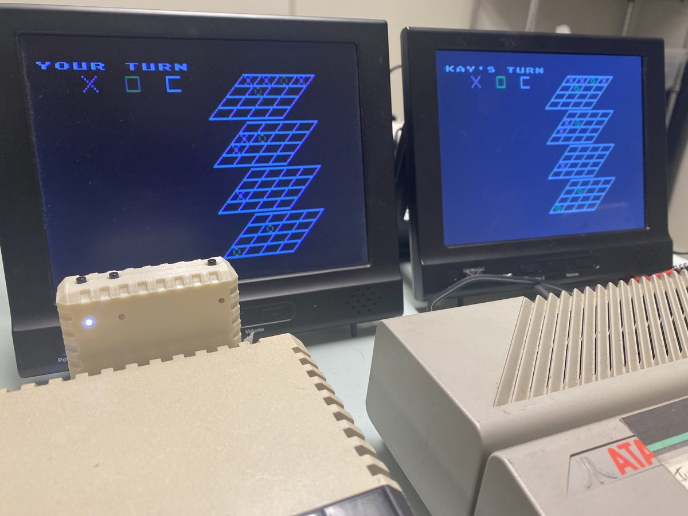
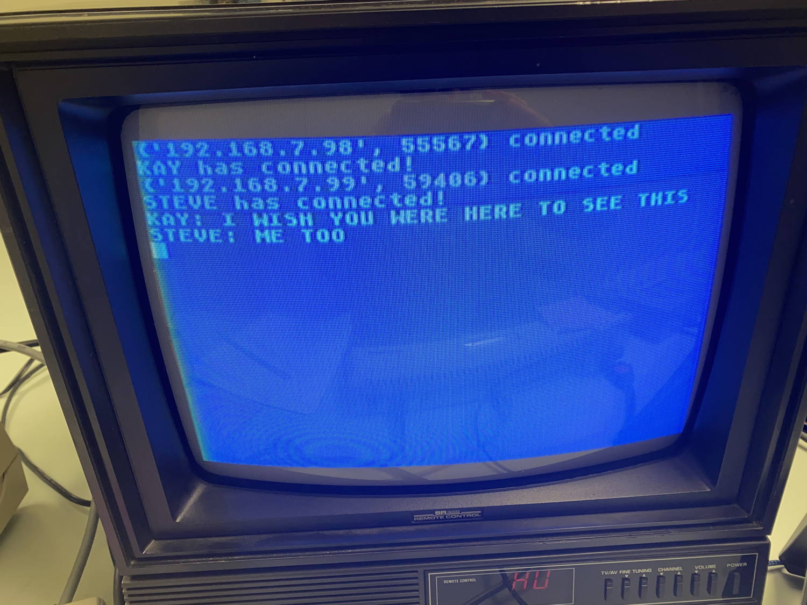

# FujiNet
Various programs in Atari BASIC for #FujiNet for Atari 8-bit

## FujiNet-3D Tic Tac Toe

In 1978, Scott Adams wrote a 3-D Tic Tac Toe game, for player vs. CPU opponent. In 1981, Tom Schaeper ported it to Atari 8-bit. In December 2020, I hacked it to work player vs. player over the Internet, using the #FujiNet Atari networking device.

## FujiNet-bounce

Bounce a ball between two Atari 8-bit computers, located in the same room or even [2,300 miles apart](https://www.youtube.com/watch?v=rhQ9YuXqrM4).
This program released under the [MIT license](https://opensource.org/licenses/MIT)

## FujiChat

A functional but half-baked chat program allowing any number of Atari 8-bit computers to text chat.
